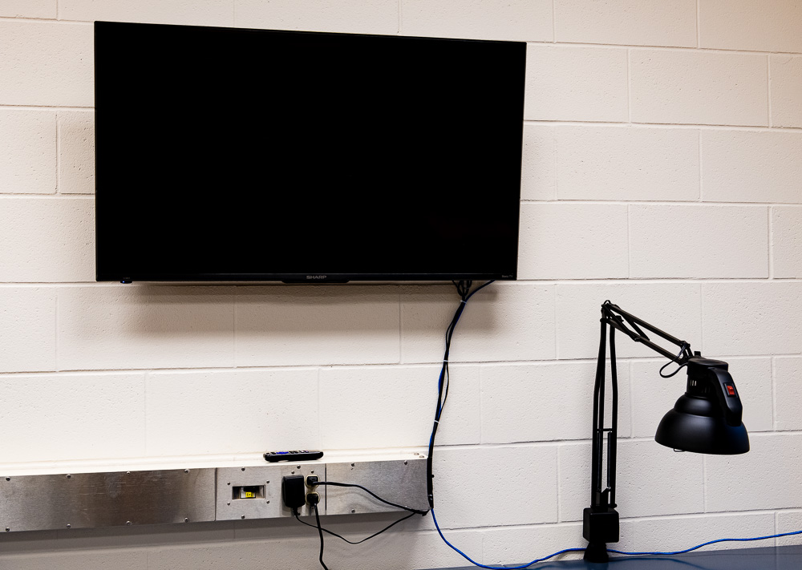

# SWSL-TV

A Python script to show images and video on a TV that can be used in a lab to profile interesting
research projects.  Also suitable as a simple digital billboard at a place of business.
Named *SWSL-TV* since this code is used to drive a 4k display for the
[Smart Water Systems Lab](https://www.usask.ca/water/research/Smart%20Water%20Systems%20Laboratory.php)
at the [University of Saskatchewan](https://www.usask.ca/).

> I want to watch television! I want to watch television! I want to watch television!
> - Mike Teavee *from* Charlie and the Chocolate Factory *by* Roald Dahl



## Getting Started

### Required Hardware and Software

#### Hardware

- [Asus Tinkerboard](https://en.wikipedia.org/wiki/Asus_Tinker_Board)
- 5V USB power supply (or alternate power through the header)
- HDMI cable
- TV
- Ethernet cable (for rsync or OS updates)

#### Software
- [GNU/Linux Tinker OS](https://tinkerboarding.co.uk/wiki/index.php/TinkerOS)
- [Python 3](https://www.python.org/)
- xset                           
- feh         					        
- gstreamer
- gst-launch-1.0      	
- unclutter                

**Python 3 Libraries**
- delegator
- holidays

### Installing

After Tinker OS is flashed to the Tinkerboard,
`feh`, `gstreamer`, `gst-launch` and `unclutter` can be installed via `apt`
and the package repositories.  The Python 3 libraries are installed via `pip3` on the Tinkerboard.
The appropriate permissions are required for `pip3` if a systemwide install is required.

```
pip3 install delegator
pip3 install holidays
```
On the Tinkerboard, in `/etc/environment` file add the following line:
```
DISPLAY=:0.0
```

This is done since the `delegator` library cannot handle the `DISPLAY=:0.0` variable setting when
`block=False`.  See the source code for further details.

The SD card can be used to hold the images and is mounted by an entry in `fstab`.
It is beyond the scope of this document to describe all of the nuances of `fstab` but
there are many good tutorials available online.

When mounted, the SD card can be populated with image and video files via `rsync` from a remote server.  
The `rsync` can run daily using a `cron` job.

All image files that can be displayed by `feh` will work with this project, and all video files
readable by `gstreamer` will be played back.  Recommended formats are `JPEG` and `MP4`.

Set the background of the LXDE window manager to complete black so that the desktop does not
show.  Also auto-hide the window panel at the bottom of the screen by right-clicking on the panel
and using the settings.

The `unclutter` utility can be set to run on startup by editing the `/etc/rc.local` file and
adding the following line:

```
unclutter -idle 0 &
```

In the `lxde-rc.xml` file, the window decorators can be turned off by replacing the following
lines:

```
<name>Onyx</name>
   <titleLayout></titleLayout>

<applications>
<application name="*">
       <decor>no</decor>
       <fullscreen>true</fullscreen>
     <maximized>true</maximized>
   </application>
 </applications>
```

To run the Python script on reboot, edit the crontab.

```
crontab -e
```

In the `crontab` file, add the following line, where
`/home/user/path/to/` is the directory where the `run-tv.py`
Python script is placed.  The user corresponding to the crontab
must have read access to the mounted directory with the picture
and video files.

```
@reboot python3 /home/user/path/to/run-tv.py &
```

The `constants.py` file must be placed in the same directory as the
`run-tv.py` file.  Edit the file accordingly as shown in the comments
below.  The `datetime` and `holidays` libraries are used.

```
import datetime
import holidays

DVID = '/path/to/display-video/'                  # video location
DPICT = '/path/to/display-pict/'                  # picture location
START_TV_TIME = datetime.time(8, 0, 0)            # 8 AM as the start time for TV
END_TV_TIME = datetime.time(17, 0, 0)             # 5 PM as the end time for TV images
DELAY_WAIT_SEC = 15                               # wait time to check the main loop
SECS_PER_PICTURE = 3                              # Time in seconds between each picture display
RUN_ON_WEEKEND = False                            # True to run on the weekend
RUN_ON_HOLIDAY = False                            # True to run during a stat holiday

# define holidays in Canada or another country (change country and province/state as required)
CA_HOLIDAYS = holidays.CountryHoliday('CA', prov='SK')

# extension for videos
VIDEO_EXT = '.mp4'
```

If another version of `gst-launch-1.0` is being used, the line that defines
`VIDEO_RUN_CMD` must be updated accordingly in the `run-tv.py` file.
The `PICTURE_CMD` variable can also be updated if different command-line arguments
for `feh` are required.

## Authors

* **Nicholas J. Kinar**

## Acknowledgments
* Full Deck Visuals (Saskatoon, Saskatchewan, Canada) for the TV image
* https://tinkerboarding.co.uk/forum/archive/index.php/thread-820.html
* [delegator](https://github.com/kennethreitz/delegator.py)
* [holidays](https://github.com/dr-prodigy/python-holidays)
